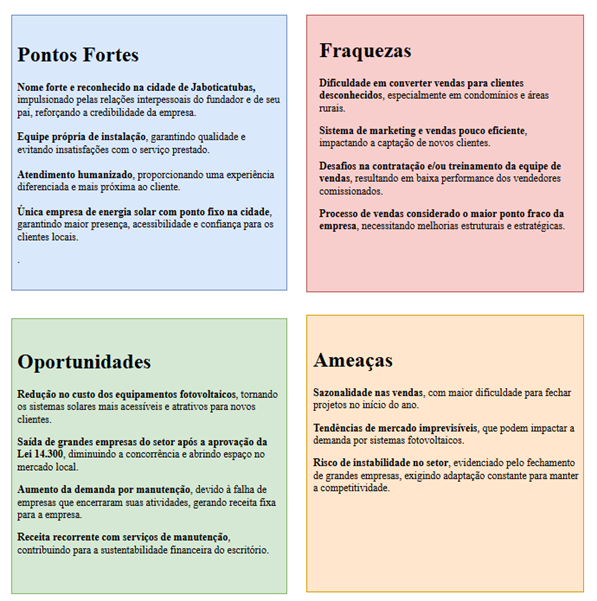
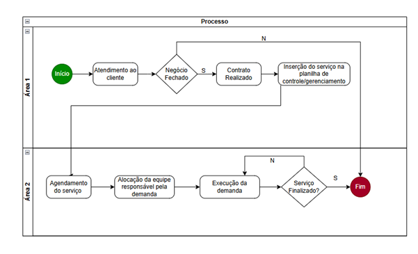

# ETAPA 1

## 1.1 Introdução

O presente trabalho será realizado em parceria com a empresa Garonce Soluções Fotovoltaicas dentro do contexto do projeto do Eixo 8, que visa capacitar os alunos como consultores de TI. Neste papel, somos encarregados de realizar um estudo detalhado da organização, compreendendo sua estrutura, seus processos internos e o mercado no qual está inserida. A partir desta análise, desenvolveremos um plano estratégico e iremos propor uma solução tecnológica que contribuirá para a otimização das operações da empresa, aumentando sua eficiência e produtividade.
A Garonce Soluções Fotovoltaicas é uma empresa brasileira especializada em energia solar, atuando desde a instalação de sistemas fotovoltaicos até a manutenção e suporte técnico, localizada em Jaboticatubas, Minas Gerais. A empresa se destaca por oferecer soluções sustentáveis e economicamente vantajosas, possibilitando uma economia significativa na conta de luz dos consumidores, podendo reduzir os custos energéticos em até 95%. 
A escolha da empresa se justifica pelo seu impacto positivo na sociedade, uma vez que seu modelo de negócio é pautado em energia alternativa, promovendo a sustentabilidade ambiental. Além disso, trata-se de uma empresa com grande potencial de crescimento, visto que a demanda por energia solar vem aumentando significativamente nos últimos anos. Dessa forma, contribuir para sua evolução ao implementar uma solução tecnológica eficaz é uma oportunidade valiosa, tanto para a empresa quanto para o desenvolvimento profissional do grupo.
 Atualmente, a gestão das obras da Garonce é realizada via planilhas do Excel, o que pode gerar desafios relacionados à organização, monitoramento das tarefas e previsão de demandas futuras.
O principal objetivo do projeto é trazer maior clareza, automação e eficiência ao gerenciamento das obras da empresa. O próprio dono da organização identificou a necessidade de um sistema informatizado que possibilite o lançamento de tarefas de forma estruturada, permitindo controle sobre informações como início e fim das atividades, priorização, identificação do cliente e lançamento de imagens diárias.
 Além disso, o projeto busca viabilizar a criação de alertas automatizados e um dashboard intuitivo e dinâmico, permitindo que a gestão seja mais assertiva, rápida e eficaz. Dessa maneira, a proposta não apenas otimizará os processos internos da empresa, mas também proporcionará uma visão mais detalhada e estratégica sobre as obras em andamento, possibilitando um crescimento mais estruturado do negócio e melhorando a experiência dos clientes atendidos.

## 1.2 Empresa do Projeto

•	**Sobre a empresa:** Empresa especializada em instalação, manutenção e gestão de usinas fotovoltaicas. Atua em todo o território nacional, com foco na região Sudeste.

•	**Localização:** Rua Benedito Quintino, 112, centro, Jaboticatubas/MG

•	**Histórico:** Empresa fundada em 2021 ainda como MEI e há dois anos enquadrada no SIMPLES como LTDA com sociedade unipessoal.

•	**Setor de atuação:** Energia solar.

•	**Sociedade:** Unipessoal, enquadramento no SIMPLES NACIONAL.

•	**Estrutura:** 1 escritório, 3 carros, ferramentas para 3 frentes de trabalhos.

•	**Porte:** Pequeno porte.

•	**Número de empregados:** 100% com prestação de serviços com 6 funcionários fixos e 2 esporádicos.

## 1.3 Análise de Mercado

A Garonce Soluções Fotovoltaicas é uma empresa brasileira especializada em soluções de energia solar, oferecendo uma variedade de serviços que abrangem desde a instalação de sistemas fotovoltaicos até a manutenção e suporte técnico. Com sede em Jaboticatubas, Minas Gerais, a empresa destaca-se por fornecer alternativas sustentáveis que promovem economia significativa na conta de luz dos consumidores, podendo alcançar até 95% de redução nos custos energéticos.  
 
**Serviços Oferecidos:**  
 
•	**Energia Solar Fotovoltaica:** Instalação de sistemas capazes de suprir todas as necessidades elétricas de residências e estabelecimentos comerciais, convertendo a energia solar em eletricidade utilizável. 
•	**Aquecedores Solares:** Soluções para aquecimento de água em chuveiros e torneiras, utilizando energia solar térmica, além de usinas térmicas solares para geração de eletricidade através de vapor produzido. 
•	**Aquecedores para Piscinas:** Tecnologia que permite o uso de piscinas em qualquer estação do ano, mantendo a água em temperaturas agradáveis mesmo durante o inverno. 
•	**Bombas Solares:** Sistemas de bombeamento que utilizam energia solar para captar água de reservatórios, poços ou aquíferos, eliminando a necessidade de baterias estacionárias. 
•	**Manutenção e Prestação de Serviços:** Serviços técnicos periódicos para garantir a eficiência e durabilidade dos sistemas instalados, incluindo verificações de conexões, ajustes e aperto de terminais e parafusos.  
 
**Desafios do Setor de Energia Solar no Brasil:**  
 
Apesar do crescimento expressivo da energia solar no país, o setor enfrenta desafios significativos:  
•	**Falta de Mão de Obra Qualificada:** A rápida expansão da demanda por instalações solares revelou uma escassez de profissionais capacitados, exigindo que empresas invistam em treinamento e adaptação de trabalhadores de outras áreas. 
•	**Limitações na Infraestrutura de Transmissão:** O aumento na produção de energia renovável tem sobrecarregado a rede elétrica nacional, levando a cortes na distribuição de energia e impactando negativamente os produtores, especialmente nas regiões com gargalos de transmissão.  
 
**Oportunidades no Setor de Energia Solar:**  
 
Apesar dos desafios, diversas oportunidades impulsionam o crescimento da energia solar no Brasil: 
 
•	**Iniciativas Comunitárias Sustentáveis:** Projetos como o desenvolvido na favela Morro da Babilônia, no Rio de Janeiro, demonstram o potencial da energia solar para fornecer eletricidade sustentável a comunidades de baixa renda, ampliando o acesso e promovendo inclusão energética.  
•	**Investimentos em Infraestrutura Energética:** Empresas como a Enel estão comprometidas em investir na melhoria e expansão das redes de distribuição no Brasil, visando renovar concessões e atender à crescente demanda por energia limpa e confiável.  
 
A Garonce Soluções Fotovoltaicas, inserida nesse contexto, posiciona-se como uma fornecedora de soluções sustentáveis e inovadoras, contribuindo para a expansão da energia solar no Brasil e enfrentando os desafios do setor com profissionalismo e dedicação.

**Principais métricas e tendências do mercado:**

O mercado de energia solar no Brasil tem apresentado crescimento significativo nos últimos anos, consolidando-se como uma das principais fontes de energia renovável do país.

Em 2024, a energia solar no Brasil atingiu uma capacidade instalada de 53 gigawatts (GW), representando um aumento de aproximadamente 40% em relação aos 37 GW registrados em 2023. Esse crescimento posiciona a energia solar como responsável por 21,9% da matriz elétrica nacional até fevereiro de 2025.

Já a Geração Distribuída se destacou com 8,51 GW de potência instaladas em 2024, demonstrando recuperação e o fortalecimento do setor fotovoltaico no Brasil. Além disso, o número de transações de fusões e aquisições em Geração Distribuída dobrou, registrando 14 operações e envolvendo 248 usinas, indicando um mercado dinâmico e em expansão.

**Tendencias Tecnológicas e de Mercado:**  
•	**Avanços em Captação e Armazenamento:** Pesquisas indicam que o uso de nanocamadas transparentes podem elevar a eficiência dos equipamentos fotovoltaicos para cerca de 26%, tornando a geração de energia mais econômica.  
•	**Desenvolvimento Global da Energia Solar:** Em 2024, módulos fotovoltaicos de 610 Wp e 585 Wp ganharam destaque, com células bifaciais tornando a produção mais eficiente e econômica.  
•	**Crescimento Global da Energia Solar:** Estima-se que a energia fotovoltaica representará 8,3% do consumo global de eletricidade em 2024, um aumento em relação aos 5,4% de 2023, evidenciando a eficiência e a crescente adoção dessa fonte energética.  

Apesar do crescimento o setor enfrenta desafios, como limitações na infraestrutura de transmissão, que podem restringir a entrega de energia gerada por fontes renováveis. Entretanto, oportunidades se apresentam com investimentos em infraestrutura energética e iniciativas comunitárias sustentáveis, ampliando o acesso à energia limpa e promovendo inclusão energética.

•	**Análise da matriz SWOT:**

 
## 1.4 Análise de Processos e Sistema
•	**Processos atuais:** Atualmente o processo entrada de demandas ocorre por prospect ou através da rede de contatos (Celular, e-mail e site). O acompanhamento de demandas e programação de obra é feito através de preenchimento semanal de uma planilha.  

•	**Diagrama de fluxo de processos:**

O processo do gerenciamento dos serviços da empresa se inicia com o Atendimento ao Cliente. Após essa etapa, ocorre uma verificação para determinar se o Negócio foi fechado.  
•	Se sim, o próximo passo é a Realização do Contrato, em relação aos serviços que serão prestados. Após isso, o serviço é inserido na planilha de controle/gerenciamento.  
•	Se não, o fluxo apenas se encerra.  

Caso o contrato tenha sido realizado, o processo segue para a fase de execução do serviço, que ocorre na Área 2. Primeiro, há o Agendamento do Serviço, seguido da Alocação da Equipe Responsável pela demanda.
Uma vez que a equipe está alocada, a Execução da Demanda acontece. Após a execução, há uma verificação se o Serviço foi Finalizado:  
•	Se sim, o processo se encerra.  
•	Se não, a execução retorna para ajustes e refinamentos até que o serviço esteja concluído.  

Por fim, o processo termina quando o serviço é devidamente finalizado e registrado.  

 
•	**Descrição dos sistemas existentes:** Planilha em Excel

•	**Nível de maturidade do sistema existentes:** Baixo (Inicial). Preenchimento manual.

•	**Identificação de oportunidades de melhoria do processo:** Identificado junto ao cliente a oportunidade de criar um eco sistema de monitoramento, que permitirá melhor detalhamento de etapas de demandas e acompanhamento de prazos através da utilização integrada de ferramentas No Code (Microsoft Forms e Planner) e Low Code (Power Automate e Power BI), possibilitando criar uma interface de cadastro e planejamento, integrados a um dashboard para análise de resultados.

## Referências

GARONCE FOTOVOLTAICA. Garonce Fotovoltaica, 2025. Disponível em: https://garoncefotovoltaica.com/ Acesso em: 25 fev. 2025.

ASSOCIAÇÃO BRASILEIRA DE ENERGIA SOLAR FOTOVOLTAICA (ABSOLAR). Energia solar atinge 40% a mais de capacidade em 2024. BE News, 2024. Disponível em: https://portalbenews.com.br/energia-solar-atinge-40-a-mais-de-capacidade-em-2024/. Acesso em: 25 fev. 2025.

GREENER. Boletim M&A: confira análise de 2024 e projeções para 2025. Canal Solar, 2024. Disponível em: https://canalsolar.com.br/boletim-ma-confira-analise-2024/. Acesso em: 25 fev. 2025.

YELLOT. Energia Solar em 2024: 5 tendências para o mercado. Yellot, 2024. Disponível em: https://yellot.com.br/tecnologia-e-inovacao/energia-solar-em-2024-5-tendencias-para-o-mercado/. Acesso em: 25 fev. 2025.

REUTERS. Brazil's grid caps power from wind and solar, threatening renewable projects. Reuters, 2024. Disponível em: https://www.reuters.com/business/energy/brazils-grid-caps-power-wind-solar-threatening-renewable-projects-2024-08-22/. Acesso em: 25 fev. 2025.
REUTERS. Enel cautious on US solar panel project, committed to Brazil grids. Reuters, 2024. Disponível em: https://www.reuters.com/business/energy/enel-cautious-us-solar-panel-project-committed-brazil-grids-2024-11-18/. Acesso em: 25 fev. 2025.
