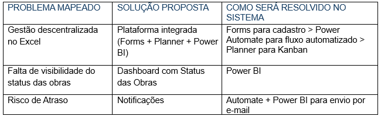
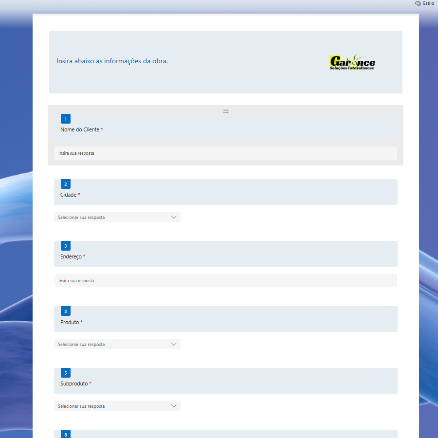
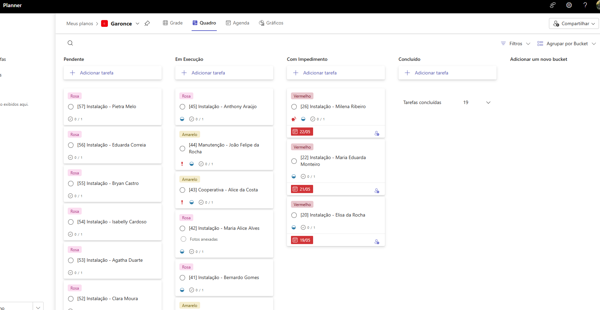
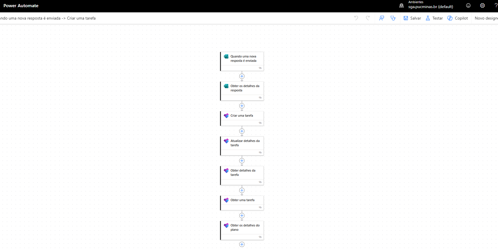
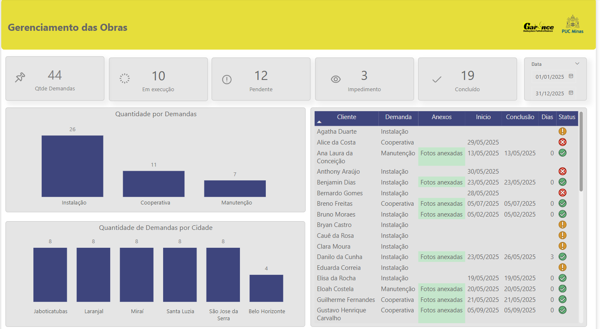

# ETAPA 3

## 12	CONEXÃO COM O PLANO DE IC E PLANEJAMENTO DA SOLUÇÃO

• Como a disponibilidade de equipe e materiais impacta o cronograma? 
•	Quais são os principais fatores que influenciam a priorização das obras na Garonce Soluções Fotovoltaicas? 
•	Quais desafios atuais na gestão de obras precisam ser superados? 
•	Quais tecnologias podem automatizar e melhorar o processo? 
•	Como prever e mitigar possíveis atrasos? 

### Dados Críticos:

•	Status das obras (não iniciadas, em andamento, finalizadas) 
•	Cronogramas e prazos contratuais 
•	Localização e logística das obras 

**Processo atual**: Entrada de demandas e acompanhamento de obras via planilhas Excel, com baixa automação, visibilidade e padronização. 

**Processos a resolver**:
•	Cadastro estruturado das obras a serem executadas.  
•	Monitoramento em tempo real do status das obras 
•	Geração de alertas e relatórios automáticos 

**Funcionalidades iniciais a serem desenvolvidas** 

•	Módulo de cadastro de obras e demandas (Forms/Planner integrados). 

•	Visão Kanban do pipeline de projetos (status: “novo”, “em execução”, “concluído”). 

•	Dashboard inicial com KPIs principais (número de obras por status, prazos críticos). 

### Quadro-resumo:

## 13	LEVANTAMENTO DE REQUISITOS E MODELAGEM INICIAL

**Proprietário**, quero cadastrar uma nova obra com dados completos (cliente, localização, prazo), para iniciar o planejamento. 

**Gestor de projetos**, quero visualizar o pipeline de obras em Kanban, para acompanhar status e prioridades. 

**Coordenador de equip**e, quero receber alertas de atrasos ou falta de recursos, para agir preventivamente. 

**Analista**, quero gerar relatório de desempenho mensal, para avaliar eficiência e gargalos. 

### Requisitos Funcionais

**RF01:** Cadastro de obras (cliente, endereço, prazo, equipe). 

**RF02:** Fluxo Kanban de status de obra. 

**RF03:** Gatilhos e alertas automáticos por condição de prazo e disponibilidade. 

**RF04:** Dashboards com KPIs (quantidade de obras, percentuais de atraso, alocação de recursos). 

**RF05:** Relatórios exportáveis (PDF/Excel). 

### Requisitos Não Funcionais

**RNF01:** Tempo de resposta dos dashboards ≤ 3s. 

**RNF02:** Acesso as ferramentas com usuário e senha. 

**RNF03:** Conformidade com LGPD (procedimentos de anonimização e consentimento).  

**RNF04:** Licença Pro do Power BI para publicação do dashboard pensando na privacidade dos dados. 

**RNF05:** Segurança do usuário. 

## 14	FERRAMENTAS 

• Coleta: Microsoft Forms, Planner, Power Automate 
• Armazenamento de Dados: Excel, Onedrive 
•	Análise & Visualização: Power BI. 

## 15	PREPARAÇÃO DO DESENVOLVIMENTO

### Forms para cadastro das obras:

### Planner para Quadro Kanban:

### Fluxo no Automate:

### Relatório no Power BI:

## 16 	PLANO DE EXECUÇÃO

**1.	Sprint 1:** Coleta de dados (Forms + Power Automate). 

**2.	Sprint 2:** Kanban (Planner + integração). 

**3.	Sprint 3:** Dashboard inicial (Power BI – versão MVP). 

**4.	Sprint 4:** Alertas e relatórios avançados. 

## 17	DIVISÃO DE TAREFAS

**•	Desenvolvimento na Power Platform:** Forms, Planner, Automate. 

**•	Análise e Visualização dos dados:** Modelagem e relatórios Power BI. 

**•	Testes:** Validação de requisitos e testes. 

**•	Documentação**. 

## 18	INÍCIO DO DESENVOLVIMENTO 

•	Configuração do ambiente Power Platform com a criação do Forms para preenchimento das obras, automação com o Power Automate e Quadro Kanban para gerenciamento das obras.

•	Dashboards Internos:

1	Visão Geral de Obras: Total por status, tempo médio de conclusão. 
2	Tendências de Prazo: Linha do tempo de início/fim previsto vs. efetivo. 
3	Comparativo Mensal: Obras iniciadas/concluídas. 

## Link do Dashboard Publicado

https://app.powerbi.com/view?r=eyJrIjoiYWU0ZWExZTctNWM4Zi00ZGM2LWE2OWUtMDIyMTBkYWVmYWJkIiwidCI6IjE0Y2JkNWE3LWVjOTQtNDZiYS1iMzE0LWNjMGZjOTcyYTE2MSIsImMiOjh9

Obs: Todos os dados do dashboard estão devidamente mascarados, em virtude da LGPD. 

## REFERÊNCIAS

GARONCE FOTOVOLTAICA. Garonce Fotovoltaica, 2025. Disponível em: https://garoncefotovoltaica.com/ Acesso em: 25 fev. 2025.

ASSOCIAÇÃO BRASILEIRA DE ENERGIA SOLAR FOTOVOLTAICA (ABSOLAR). Energia solar atinge 40% a mais de capacidade em 2024. BE News, 2024. Disponível em: https://portalbenews.com.br/energia-solar-atinge-40-a-mais-de-capacidade-em-2024/. Acesso em: 25 fev. 2025.

GREENER. Boletim M&A: confira análise de 2024 e projeções para 2025. Canal Solar, 2024. Disponível em: https://canalsolar.com.br/boletim-ma-confira-analise-2024/. Acesso em: 25 fev. 2025.

YELLOT. Energia Solar em 2024: 5 tendências para o mercado. Yellot, 2024. Disponível em: https://yellot.com.br/tecnologia-e-inovacao/energia-solar-em-2024-5-tendencias-para-o-mercado/. Acesso em: 25 fev. 2025.

REUTERS. Brazil's grid caps power from wind and solar, threatening renewable projects. Reuters, 2024. Disponível em: https://www.reuters.com/business/energy/brazils-grid-caps-power-wind-solar-threatening-renewable-projects-2024-08-22/. Acesso em: 25 fev. 2025.

REUTERS. Enel cautious on US solar panel project, committed to Brazil grids. Reuters, 2024. Disponível em: https://www.reuters.com/business/energy/enel-cautious-us-solar-panel-project-committed-brazil-grids-2024-11-18/. Acesso em: 25 fev. 2025.

ABREU, Jacqueline de Souza. Proteção de dados pessoais e persecução criminal à luz da LGPD. Revista do Advogado, São Paulo, v. 39, n. 144, p. 149-153, nov. 2019.

VOIGT, Paul, and Axel von dem Bussche. The EU General Data Protection Regulation (GDPR): A Practical Guide. Springer, 2017.

CALDER, Alan. ISO/IEC 27001:2013: An Introduction to Information Security and the ISO27001 Standard. IT Governance Publishing, 2013.

